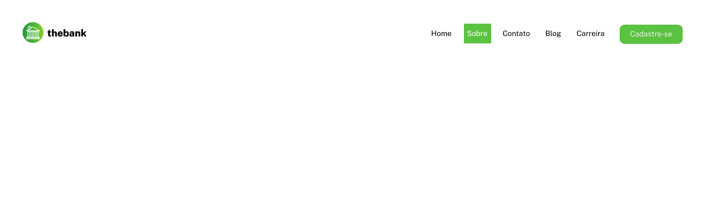
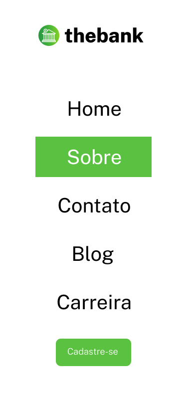

# Menu com flexbox

Desafio realizado durante o módulo de css avançado - flexbox do curso DevQuest.

## Overview

Os usuários devem ser capazes de:

- Visualizar o layout ideal para a página, dependendo do tamanho da tela do dispositivo;
- Veja o layout de um menu com flexbox sobre o tema: Thebank

### Desktop Preview

### Mobile Preview

### Tecnologias

- HTML
- CSS (Flexbox)